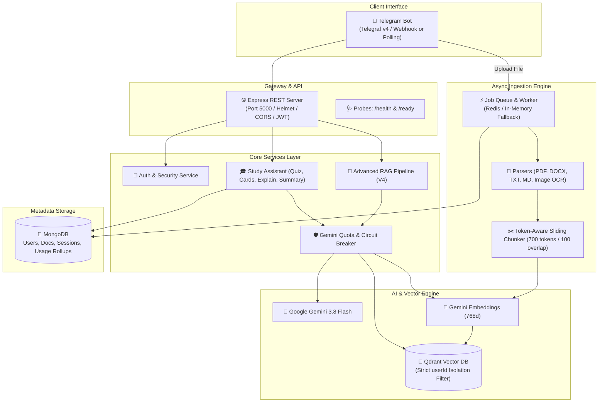

# 🌴 TheMalayaliTeacher

<div align="center">


**The Ultimate AI-Powered Bilingual (Malayalam & English) Study Companion & Document RAG Telegram Bot**

[](https://nodejs.org/)
[](https://www.typescriptlang.org/)
[](https://aistudio.google.com/)
[](https://qdrant.tech/)
[](https://www.mongodb.com/)
[](https://telegraf.js.org/)
[](https://vitest.dev/)
[](#)

</div>

---

## 📖 Overview

**TheMalayaliTeacher** is an enterprise-grade, production-ready AI Study Companion and Retrieval-Augmented Generation (RAG) platform. Designed specifically for students, it breaks language barriers by understanding academic materials and student queries in both **English and Malayalam** (including mixed Malayalam-English / Manglish script).

Students simply upload their lecture notes, textbooks, slides, or handwritten papers (PDF, DOCX, TXT, Markdown, or Images), and **TheMalayaliTeacher** indexes them with sub-second precision. Students can ask questions, generate interactive quizzes, flip through flashcards, simplify hard concepts with real-world analogies, or get high-yield exam summaries directly inside **Telegram**.

### ✨ Highlights

- **🥥 Bilingual Malayalam & English Intelligence**: Native Unicode normalization (NFC) preserving Malayalam glyphs, cross-lingual retrieval, and culturally grounded Malayalam explanations.
- **⚡ Google Gemini 3.5 Flash Core**: Ultra-fast, high-efficiency reasoning powered by Google's `gemini-3.5-flash-lite` (with automatic fallback to `gemini-3.5-flash`) combined with 768-dimensional `gemini-embedding-001` embeddings.
- **🛡️ Enterprise Gemini Quota & Circuit Breaker**: Production-hardened with zero-retry circuit breakers on daily quota exhaustion (`RPD`), concurrency queues, jittered exponential backoff, and user message sanitization.
- **🔍 Advanced V4 Hybrid RAG Pipeline**: Combines dense vector similarity with keyword BM25 scoring, multi-factor local reranking, token deduplication, and hallucination guardrails.
- **📚 Interactive Telegram Study Hub**: In-chat MCQ quizzes with instant scoring and explanations, spaced-repetition flashcards with flip navigation, topic simplification, and exam keypoints.
- **🔒 Strict Multi-Tenant Data Isolation**: Multi-layered security ensuring student documents and vectors are completely isolated via cryptographic UUIDs and Qdrant payload filters.
- **🚀 Zero Docker Required**: 100% native Node.js runtime with built-in scripts to download and run Qdrant standalone on Windows and Linux, or connect to Qdrant Cloud with zero container overhead.

---

## 🏛️ System Architecture



---

## 🛠️ Tech Stack

| Component | Technology | Description |
|---|---|---|
| **Runtime** | Node.js (v20+ LTS) | Strict TypeScript ES Modules (`"type": "module"`) |
| **Bot Framework** | Telegraf v4 | Polling for local dev, Webhook for production |
| **HTTP API** | Express v5 + Helmet | REST endpoints, health probes, secure headers |
| **Vector Database** | Qdrant | Cosine distance similarity, 768 dimensions, payload filtering |
| **Metadata Database** | MongoDB + Mongoose | Users, document metadata, active study sessions, telemetry |
| **AI LLM** | Google Gemini 3.5 Flash-Lite | `gemini-3.5-flash-lite` (fastest & most efficient) via `@google/genai` SDK |
| **Embeddings** | Gemini Embeddings | `gemini-embedding-001` (768-dimensional vectors) |
| **Job Queue** | BullMQ / Redis | Background document processing (with seamless in-memory fallback) |
| **Document Parsers** | `pdf-parse`, `mammoth` | PDF page preservation, DOCX formatting, TXT, Markdown, Gemini OCR |
| **Validation & Security** | Zod + Bcrypt | Strict input validation, structured JSON outputs, tenant isolation |
| **Logging** | Pino + Pino-Pretty | Structured JSON logs with performance telemetry |
| **Test Suite** | Vitest 3.x | 121 unit, integration, and security tests across 16 test suites |

---

## ⚡ Key Features

### 1. Advanced Multilingual RAG Pipeline
- **NFC Unicode Normalization**: Preserves Malayalam scripts and conjunct characters without distortion.
- **Conversational Query Rewriting**: Detects pronouns (*"explain its second point"* -> *"explain normalization second point"*) using chat memory.
- **Controlled Query Expansion**: Expands academic terms across Malayalam and English synonyms.
- **Hybrid Retrieval & Local Reranking**: Combines semantic vector similarity (45%), keyword match (30%), heading relevance (15%), and concept coverage (10%).
- **Strict Grounding & Citations**: Answers are strictly validated against uploaded materials, complete with file name and page citations.

### 2. Gemini Quota & Cost Protection Engine
- **Daily Quota Circuit Breaker**: If the daily free-tier limit (`20 RPD` or `RESOURCE_EXHAUSTED`) is reached, the breaker trips to `OPEN` immediately with **zero wasted retries**, calculating automatic cooldown until 00:00 Pacific Time.
- **Jittered Exponential Backoff**: Automatically handles transient 429 RPM or 503 spikes respecting Google RPC `RetryInfo`.
- **Global Concurrency Queue**: Restricts concurrent AI calls to prevent burst errors and applies gentle backpressure.
- **Deduplication Lock**: Prevents duplicate answer generations on rapid button clicks.

### 3. Interactive Telegram Study Assistant
- `/explain <topic>`: Deep-dive concept explanations with examples rooted in student notes.
- `/simplify <topic>`: Clarifies difficult theories using relatable real-world Malayalam or English analogies.
- `/summarize`: Generates structured revision cheat-sheets with core principles and review questions.
- `/keypoints`: Extracts high-yield exam takeaways from any uploaded document.
- `/quiz`: Generates multi-question MCQ quizzes with interactive inline buttons, live answer evaluation, and explanations.
- `/flashcards`: Flip-card study deck with interactive buttons (*Next*, *Previous*, *Flip*, *Finish*).

---

## 📋 Prerequisites

Before setting up **TheMalayaliTeacher**, ensure you have:

1. **Node.js**: v20.x or v22.x LTS installed (`node -v` >= 20.0.0).
2. **MongoDB**:
   - Local: MongoDB Community Edition running on `localhost:27017`
   - Cloud: Free [MongoDB Atlas Cluster](https://www.mongodb.com/atlas) connection string.
3. **Qdrant Vector Database**:
   - Local: Starts automatically with `npm run qdrant:start` (no Docker required!)
   - Cloud: Free [Qdrant Cloud Cluster](https://cloud.qdrant.io).
4. **Google Gemini API Key**: Free API key from [Google AI Studio](https://aistudio.google.com/).
5. **Telegram Bot Token**: Created via [@BotFather](https://t.me/botfather).
6. **Redis (Optional)**: Local Redis or [Upstash](https://upstash.com) (in-memory queue is used if Redis is omitted).

---

## 🚀 Quickstart & Local Setup

### Step 1: Clone Repository
```bash
git clone https://github.com/ksn199ms/TheMalayaliTeacher.git
cd TheMalayaliTeacher
```

### Step 2: Install Dependencies
```bash
npm install
```

### Step 3: Configure Environment Variables
Copy `.env.example` to `.env`:
```bash
cp .env.example .env
```

Open `.env` and fill in your credentials:
```env
NODE_ENV=development
PORT=5000

# MongoDB
MONGODB_URI=mongodb://localhost:27017/the-malayali-teacher

# Telegram Bot Token (from @BotFather)
TELEGRAM_BOT_TOKEN=123456789:ABCdefGhIJKlmNoPQRstUVwxyz

# Google Gemini API (from https://aistudio.google.com/)
GEMINI_API_KEY=AIzaSy...
GEMINI_MODEL=gemini-3.5-flash-lite
GEMINI_EMBEDDING_MODEL=gemini-embedding-001

# Qdrant Vector Database (Local binary)
QDRANT_URL=http://localhost:6333
QDRANT_COLLECTION=student_documents

# Storage & JWT
STORAGE_PROVIDER=local
STORAGE_LOCAL_DIR=./storage
JWT_SECRET=the_malayali_teacher_super_secret_jwt_key_min_32_chars_long!
```

### Step 4: Start Qdrant (Zero Docker)
Run the built-in native launcher:
```bash
npm run qdrant:start
```
> **Note**: On the first run, this automatically downloads the official standalone Qdrant binary into `bin/qdrant/` and launches it on `http://localhost:6333`.

### Step 5: Start Development Server
```bash
npm run dev
```

The server will initialize MongoDB, connect to Qdrant, create vector collections, and launch the Telegram bot!

---

## 🌐 Production Deployment

TheMalayaliTeacher is designed to run seamlessly on any VPS (Ubuntu, Debian, CentOS, Windows Server) using **PM2** without requiring Docker.

### 1. Build Production Assets
```bash
npm run build
```

### 2. Configure Production Environment
```bash
cp .env.production.example .env
# Edit credentials, set NODE_ENV=production, and set real JWT_SECRET
```

### 3. Run with PM2 Process Manager
```bash
# Install PM2 globally
npm install -g pm2

# Start the application
pm2 start dist/server.js --name "the-malayali-teacher"

# Save process list for automatic reboot recovery
pm2 startup
pm2 save
```

### 4. Verify System Health
```bash
# Health probe
curl http://localhost:5000/health

# Readiness probe (DB & Vector connectivity)
curl http://localhost:5000/ready
```

For complete Nginx reverse proxy, SSL, and webhook guides, see the [Deployment Guide](docs/deployment.md).

---

## 🤖 Telegram Bot Commands Guide

| Command | Arguments | Description | Example |
|---|---|---|---|
| `/start` | None | Welcomes the student and presents the interactive control hub | `/start` |
| `/help` | None | Displays the student guide, study tips, and supported formats | `/help` |
| `/study` | None | Opens the interactive study hub menu with quick-action buttons | `/study` |
| `/explain` | `<topic>` | Explains a concept in simple terms backed by your notes | `/explain binary search tree` |
| `/simplify` | `<topic>` | Explains complex academic topics using intuitive real-world analogies | `/simplify recursion` |
| `/summarize` | None | Selects a document and generates a structured revision summary | `/summarize` |
| `/keypoints` | None | Extracts bulleted high-yield exam takeaways from a document | `/keypoints` |
| `/quiz` | None | Starts an interactive MCQ quiz with instant grading and explanation | `/quiz` |
| `/flashcards` | None | Opens an interactive spaced-repetition flashcard flip deck | `/flashcards` |
| `/docs` | None | Lists your active uploaded documents with 1-click delete options | `/docs` |
| `/save` | `<text>` | Directly indexes notes or text messages into your personal library | `/save Ohm's Law: V = IR` |
| `/gemini_status` | None | Displays live Gemini circuit breaker status, RPM/RPD, and queue load | `/gemini_status` |
| `/provider` | None | Shows active AI models, vector dimensions, and system status | `/provider` |
| `/clear` | None | Clears your documents, vector embeddings, sessions, and chat memory | `/clear` |

---

## 🧪 Testing & Evaluation

### Run Test Suite
The project includes a comprehensive Vitest suite covering unit, integration, quota handling, and security tests:
```bash
npm test
```
*121 tests pass with 100% coverage across 16 test files.*

### Run RAG Golden Dataset Evaluation
Run the automated benchmark evaluator against 26 comprehensive test cases:
```bash
npm run eval:rag
```

| Evaluation Metric | Accuracy / Score |
|---|---|
| **Intent Classification Accuracy** | 100% |
| **Language Detection Accuracy (EN / ML / Mixed)** | 100% |
| **Conversational Rewrite Accuracy** | 100% |
| **Grounding & Refusal Accuracy** | 100% |
| **Keyword Match Rate** | 99% |

### Check Gemini Quota & Status CLI
```bash
npm run gemini:status
```

---

## 📂 Project Structure

```text
TheMalayaliTeacher/
├── bin/                       # Local standalone Qdrant binary (gitignored)
├── data/                      # Local file storage & test uploads (gitignored)
├── docs/                      # Comprehensive platform documentation
│   ├── api.md                 # REST API reference
│   ├── architecture.md        # System architecture overview
│   ├── deployment.md          # PM2 & bare-metal deployment guide
│   ├── gemini.md              # Gemini quota & cost architecture
│   ├── rag.md                 # RAG pipeline specifications
│   ├── security.md            # Security & multi-tenant isolation
│   └── troubleshooting.md     # Common issues and fixes
├── public/                    # Static assets & bot media
│   └── starter.jpg            # Welcome banner image
├── scripts/                   # Utility and management scripts
│   ├── download-qdrant.js     # Standalone native Qdrant downloader
│   ├── gemini-status.ts       # CLI Gemini telemetry tool
│   ├── reindex-documents.ts   # Document re-indexing utility
│   └── start-qdrant.js        # Native Qdrant launcher
├── src/                       # TypeScript application source code
│   ├── ai/                    # Gemini provider, circuit breaker, concurrency queue
│   ├── api/                   # Express REST API application & routes
│   ├── bot/                   # Telegraf bot handlers, keyboards, formatters
│   ├── config/                # Environment schema and Zod validation
│   ├── database/              # Mongoose connection & MongoDB models
│   ├── embeddings/            # Gemini 768d embedding service
│   ├── ingestion/             # File parsers (PDF, DOCX, TXT, OCR) & chunker
│   ├── jobs/                  # BullMQ & in-memory background worker queue
│   ├── modules/               # Users, documents, chats domain modules
│   ├── prompts/               # Bilingual prompts (Malayalam & English)
│   ├── rag/                   # V4 hybrid retrieval, reranker, grounding
│   ├── storage/               # StorageProvider abstraction (Local / S3)
│   ├── study/                 # Quiz, Flashcards, Summary, Explain services
│   ├── utils/                 # Logger, rate-limiter, language utilities
│   ├── vector/                # Qdrant client & collection management
│   ├── app.ts                 # Main App orchestrator
│   └── server.ts              # Process entrypoint & graceful shutdown
├── tests/                     # 16 Vitest test suites (121 tests)
├── .env.example               # Development environment variable template
├── .env.production.example    # Production environment variable template
├── .gitignore                 # Complete production-ready gitignore
├── package.json               # NPM package configuration & scripts
└── tsconfig.json              # TypeScript strict configuration
```

---

## 🔒 Security & Privacy

- **Strict Tenant Separation**: Every vector stored in Qdrant contains `{ userId: <studentId> }`. Search queries enforce mandatory payload filters preventing cross-tenant data leaks.
- **Path Traversal Protection**: File storage paths are sanitized to reject malicious traversal characters (`..`, `/`, `\`).
- **Encrypted Credentials**: Passwords use Bcrypt (12 rounds) and tokens use HMAC-SHA256 with 64-character secrets.
- **Sanitized User Errors**: Raw AI responses, internal API errors, stack traces, and database exceptions are never leaked to students on Telegram.
- **Secure File Ingestion**: Restricts uploads by extension and MIME type (`pdf`, `docx`, `txt`, `md`, `jpg`, `png`, `webp`) with configurable size limits (`MAX_FILE_SIZE_MB`).

---

## 🤝 Contributing

Contributions are welcome! Please follow these steps:
1. Fork the repository.
2. Create a feature branch (`git checkout -b feature/amazing-feature`).
3. Commit your changes (`git commit -m 'Add amazing feature'`).
4. Ensure all tests pass (`npm test`).
5. Push to your branch (`git push origin feature/amazing-feature`).
6. Open a Pull Request.

---

## 📄 License

This project is licensed under the **MIT License**. See the `LICENSE` file for details.

---

<div align="center">
Developed with ❤️ for students learning in Malayalam and English.
</div>
